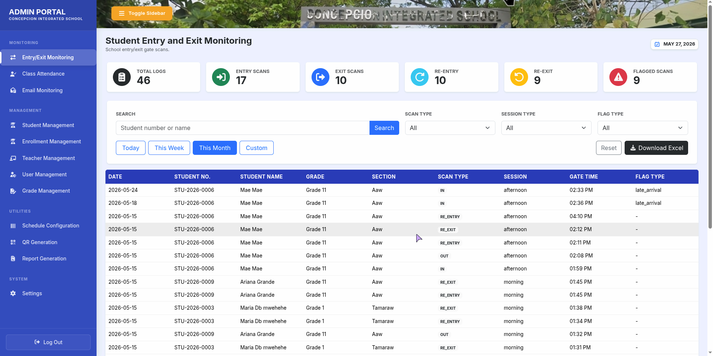

# Web-Based QR Student Attendance Monitoring with Centralized Academic Management System

An enterprise-grade educational platform currently under active development. The system is designed to automate gate access tracking, detect attendance anomalies, and centralize student records for Concepcion Integrated School (CIS) spanning Grades 1 to 12.

## 🛠️ Project Status: In Development
This project is currently in its active development phase. Core database architecture and initial module structures are being implemented. 

## 🚀 Key Planned Features

* **Dual-Layer QR Scanning:** Live tracking dashboards for school gate monitoring (Gate IN/OUT tracking) and classroom-specific lecture attendance logging.
* **Automated Guardian Notifications:** Triggers instantaneous email alerts to registered parents or guardians upon a student’s campus entry/exit, complete with an administrative status monitoring and resend dashboard.
* **Bulk QR Management:** Automatically generates unique student QR identifiers with support for individual or batch/section exports bundled into convenient ZIP/PDF archives.
* **Role-Based Access Control (RBAC):** Strict security boundaries restricting system tools between Administrators, Advisory Teachers and Subject Teachers.
* **Granular Reporting:** High-density data views to export structured summaries, entry/exit trends, or historical records into universal PDF and CSV/Excel formats.

## 💻 Tech Stack (Under Implementation)

* **Backend & Logic:** PHP, Laravel Framework (MVC Architecture, Eloquent ORM, Routing)
* **Database Layer:** MySQL (Decoupled relational schema separating core profile records from high-frequency dynamic logging tables)
* **Frontend Interface:** JavaScript, Bootstrap, HTML5, CSS3 (High-density, minimalist grid layout to maximize data density and minimize scrolling)
* **API Development & Testing:** Postman

## 📁 System Architecture

The application implements a secure **three-tier client-server model**:
1. **Presentation Tier:** Role-optimized web interfaces for Admins, Teachers, and Gate Scanners.
2. **Application Tier:** Powered by Laravel, handling core business logic, ID validation, security filters, and notification queues.
3. **Data Tier:** Centralized MySQL database server mapping data entities safely with enforced relational integrity constraints.

## 👥 Project Team (Baliwag Polytechnic College)

* **Arriane R. Estrada** – Lead Full-Stack Developer
* **Trisha Mae V. Martinez** – Frontend / UI/UX Design Collaborator
* **Leeneth Anne T. Ringor** - Business Analyst
* **Arvin Jayson M. Simeon** - QA Tester
* **Jodie A. Yambao** -Project Manager

---
*This project is under active development as an official undergraduate capstone project in partial fulfillment of the requirements for the degree of Bachelor of Science in Information Technology at the Institute of Information Technology and Innovation, Baliwag Polytechnic College.*