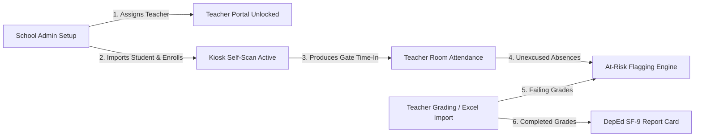

# Developer Guide: How to Code & Work per Point of View (POV)

Welcome to the **CIS_CAPSTONE Developer Guide**. This guide is written specifically for **you as a developer** (and for instructing AI assistants) when adding features, modifying pages, or debugging code in this repository.

Instead of generic system user steps, this guide teaches you:
1. **How the codebase is isolated per Point of View (POV)**.
2. **Where to find files immediately** using the 1-to-1 Sidebar-to-Folder mapping.
3. **How to instruct the AI and code safely** without accidentally breaking other POVs.
4. **The cross-module ripple effects ("kapag ganito, ganyan")** when touching database models and services.

---

## 1. Golden Rule: How to Code & Instruct the AI per POV

Because the application is strictly partitioned into 4 distinct POVs (`Teacher`, `School Admin`, `Scanner Operator`, and `Super Admin`), **you must never mix POV code**.

### How to Instruct the AI Assistant:
When asking an AI assistant to implement or fix a feature, **always declare the target POV and set explicit boundaries**:

```text
PROMPT TEMPLATE FOR AI:

"I am working on the [Teacher / School Admin / Scanner Operator / Super Admin] POV.
Target feature: [Feature Name, e.g. My Classes Grade Sheet / Bulk Import / Room Attendance].
Please only modify files inside:
- resources/views/pov/[role]/[feature-folder]/
- app/Http/Controllers/[Role]/[FeatureFolder]/
- routes/[role].php
DO NOT modify or touch files belonging to other POVs or unrelated shared models unless explicitly asked."
```

### Why This Rule Is Critical:
* **Prevents Cross-POV Breakage**: If an AI edits a shared model query carelessly, it could break another role's views (e.g. changing `TeachingAssignment` queries can break both Teacher grade sheets and School Admin assignment lists).
* **Guarantees Role Authorization**: Each POV is bound to its own route middleware (`role:teacher`, `role:school_admin`, etc.). Keeping code in the proper folder ensures routes and views don't leak permissions.

---

## 2. Codebase Architecture Overview Tree

Here is how the project is physically partitioned across folders:

```text
CIS_CAPSTONE/
├── routes/
│   ├── teacher.php                 # All Teacher routes
│   ├── school-admin.php            # All School Admin routes
│   ├── scanner-operator.php        # All Scanner Operator kiosk & log routes
│   ├── super-admin.php             # All Super Admin user & audit routes
│   ├── web.php                     # Root landing & authentication redirects
│   └── api.php                     # Mobile / hardware endpoints
├── app/
│   ├── Http/Controllers/
│   │   ├── Teacher/                # Controllers isolated to Teacher portal
│   │   ├── SchoolAdmin/            # Controllers isolated to School Admin portal
│   │   ├── ScannerOperator/        # Controllers isolated to Kiosk terminal
│   │   ├── SuperAdmin/             # Controllers isolated to Super Admin portal
│   │   └── Shared/                 # Shared profile & utility controllers
│   ├── Models/                     # Eloquent models (shared database tables)
│   └── Services/                   # Core business logic (Grading, Attendance, BulkImport)
├── resources/
│   ├── views/pov/                  # Blade views organized strictly by POV
│   │   ├── teacher/                # Folders match Teacher sidebar navigation
│   │   ├── school-admin/           # Folders match School Admin sidebar navigation
│   │   ├── scanner-operator/       # Folders match Scanner Operator sidebar navigation
│   │   └── super-admin/            # Folders match Super Admin sidebar navigation
│   └── css/pov/                    # Scoped stylesheets per POV
│       ├── teacher/
│       ├── school-admin/
│       ├── scanner-operator/
│       └── super-admin/
```

---

## 3. Sidebar-to-Folder Mapping: Where to Find Everything

Each POV's views and controllers are deliberately structured to match the **Sidebar menu items**. When you look at any page in the UI, you can immediately find its code using the lookup tables below:

### 🎓 A. Teacher POV

* **Route File**: [routes/teacher.php](file:///home/catsu/Desktop/CIS_CAPSTONE/routes/teacher.php)
* **Layout Blade**: `resources/views/components/layouts/teacher.blade.php`
* **Sidebar Component**: `resources/views/components/layouts/teacher/sidebar.blade.php`

| Sidebar Navigation Label | View Directory (`resources/views/pov/teacher/`) | Controller Directory (`app/Http/Controllers/Teacher/`) | Primary Responsibility |
|---|---|---|---|
| **Room Attendance** | `attendance/` | `Attendance/` (`TeacherRoomAttendanceController`) | Subject period attendance verification & discrepancy checks |
| **Student Management** | `student-management/` | `StudentManagement/` (`StudentManagementController`) | Viewing students within teacher's assigned classes |
| **My Classes** | `my-classes/` | `MyClasses/` (`GradingDashboardController`, `GradeSheetController`) | Class rosters, trimester grade sheets, raw score entry |
| **Import Data (DepEd)** | `import-data/` | `ImportData/` (`DepEdClassRecordImportController`) | Uploading official DepEd E-Class Excel records to batch populate scores |
| **Analytics** | `analytics/` | `Analytics/` (`AnalyticsController`) | Class grade distributions, passing rates, component breakdown |
| **At-Risk** | `at-risk/` | `AtRisk/` (`AtRiskController`) | Early warning alerts for students failing or chronically absent |
| **Students** | `students/` | `Students/` (`StudentProfileSearchController`) | Academic profile lookup for enrolled students |
| **Reports** | `reports/` | `Reports/` (`ReportsController`) | Generating official DepEd Form 9 (SF-9) progress report cards |
| **Grading Rules** | `grading-rules/` | `GradingRules/` (`GradingRulesController`) | Reference guide for DepEd Order No. 8 weights & transmutations |
| **Settings & Notifications** | `settings/`, `notifications/` | `Settings/` | Profile updates, password changes, notification preferences |

---

### 🏫 B. School Admin POV

* **Route File**: [routes/school-admin.php](file:///home/catsu/Desktop/CIS_CAPSTONE/routes/school-admin.php)
* **Layout Blade**: `resources/views/components/layouts/school-admin.blade.php`
* **Sidebar Component**: `resources/views/components/layouts/school-admin/sidebar.blade.php`

| Sidebar Navigation Label | View Directory (`resources/views/pov/school-admin/`) | Controller Directory (`app/Http/Controllers/SchoolAdmin/`) | Primary Responsibility |
|---|---|---|---|
| **Dashboard** | `dashboard/` | `Dashboard/` (`DashboardController`) | High-level school KPIs, attendance rates, recent logs |
| **QR Station (Monitor)** | `qr-station/` | `QrStation/` (`QrStationController`) | Live administrative monitoring of campus kiosk activity |
| **In/Out Monitoring** | `in-out-monitoring/` | `InOutMonitoring/` (`AttendanceLogController`, `EmailLogController`) | Unified gate scan history and guardian email delivery monitoring (tabbed view) |
| **Attendance** | `attendance/` | `Attendance/` (`ClassAttendanceController`) | Institutional attendance overview across grade levels and sections |
| **Attendance Analytics** | `attendance-analytics/` | `AttendanceAnalytics/` (`AttendanceAnalyticsController`) | Dedicated deep attendance insights, punctuality trends, and metrics |
| **Teachers** | `teachers/` | `Teachers/` (`TeacherManagementController`) | Managing teacher profiles, specialties, and active assignment counts |
| **Students** | `students/` | `Students/` (`StudentManagementController`) | Student master records, LRNs, section enrollment, guardian contacts |
| **Bulk Import** | `bulk-import/` | `BulkImport/` (`BulkImportController`) | Excel/CSV ingestion pipeline for bulk student onboarding |
| **Academic** | `academic/` | `Academic/` (`AcademicController`) | School year activation, grade level creation, and section setup |
| **Teaching Assignments** | `teaching-assignments/` | `TeachingAssignments/` (`TeachingAssignmentController`) | Linking teachers to specific subjects and sections |
| **Schedule Configuration**| `schedule-configuration/` | `ScheduleConfiguration/` (`ScheduleConfigController`) | Bell schedules, scan windows (morning/afternoon), and late thresholds |
| **QR Generation** | `qr-generation/` | `QrGeneration/` (`QrCodeController`) | Generating and printing physical QR badge cards for students |
| **Settings** | `settings/` | `Settings/` (`SettingsController`) | School institutional metadata, logo, contact information |

---

### 📷 C. Scanner Operator POV

* **Route File**: [routes/scanner-operator.php](file:///home/catsu/Desktop/CIS_CAPSTONE/routes/scanner-operator.php)
* **Layout Blade**: `resources/views/components/layouts/scanner-operator.blade.php`

| Sidebar / Feature Label | View Directory (`resources/views/pov/scanner-operator/`) | Controller Directory (`app/Http/Controllers/ScannerOperator/`) | Primary Responsibility |
|---|---|---|---|
| **Dashboard** | `dashboard/` | `Dashboard/` | Daily station statistics, active kiosk status |
| **QR Scan Station (Kiosk)**| `qr-station/` | `QrStation/` (`QrStationController`, `ScanController`) | Fullscreen autonomous self-service QR scanning kiosk for students |
| **In/Out History** | `time-in-time-out-history/` | `TimeInTimeOutHistory/` (`AttendanceLogController`) | Read-only daily time-in and time-out inspection for station operators |

---

### 🛡️ D. Super Admin POV

* **Route File**: [routes/super-admin.php](file:///home/catsu/Desktop/CIS_CAPSTONE/routes/super-admin.php)
* **Layout Blade**: `resources/views/components/layouts/super-admin.blade.php`

| Sidebar Navigation Label | View Directory (`resources/views/pov/super-admin/`) | Controller Directory (`app/Http/Controllers/SuperAdmin/`) | Primary Responsibility |
|---|---|---|---|
| **Dashboard** | `dashboard/` | `Dashboard/` | System-wide statistics and server health metrics |
| **User Management** | `user-management/` | `UserManagement/` (`TeacherProvisioningController`) | Sole authority to create new teacher login accounts and credentials |
| **Security Audit Log** | `security-audit-log/` | `Security/` (`SecurityAuditLogController`) | Comprehensive audit trail of logins, IP addresses, and critical actions |
| **Recent Activity** | `recent-activity/` | `Security/` (`RecentActivityController`) | Live stream of administrative events and system notifications |

---

## 4. Strict Isolation Rules When Writing Code

Follow these architectural boundaries to prevent bugs and security vulnerabilities:

1. **When Coding in Teacher POV**:
   * **Rule**: Always scope queries via `teaching_assignments`.
   * **Do**:
     ```php
     $assignment = TeachingAssignment::where('id', $assignmentId)
         ->where('teacher_id', auth()->user()->teacher->id)
         ->firstOrFail();
     ```
   * **Don't**: Never do `Student::all()` or allow teachers to access section data without verifying they are assigned to it.

2. **When Coding in Scanner Operator POV**:
   * **Rule**: Scanner Operator is strictly an autonomous kiosk runner.
   * **Do**: Keep controllers focused on camera stream capture, barcode scanner inputs, cooldown enforcement, and daily logs.
   * **Don't**: Never add links or controller access to student grades, academic configurations, or user settings. Scanner operator routes must return `403 Forbidden` if unauthorized endpoints are accessed.

3. **When Coding in School Admin vs Super Admin**:
   * **Rule**: Separate academic organization from user credentials.
   * **School Admin** can assign teachers to classes, but **cannot** create new user accounts or passwords.
   * **Super Admin** is the only role with the `TeacherProvisioningController` to generate new login credentials.

---

## 5. Cross-POV Ripple Effects ("Kapag Ganito, Ganyan")

When you modify code or database records in one POV, remember the downstream effects:



* **Kapag nag-assign si School Admin ng subject at section sa Teacher**:
  Kusang mag-a-appear ang klase sa Teacher's `My Classes` dashboard at `Room Attendance`. Kapag tinanggal ang assignment, agad ding mawawala sa view ng teacher.
* **Kapag nag-import si School Admin ng students nang walang section**:
  Hindi makakapag-scan ang estudyante sa QR Kiosk terminal. Magbabalik ang scan engine ng `404 No active enrollment` hangga't hindi siya ine-enroll sa isang section.
* **Kapag nag-scan ang student sa QR Kiosk (Scanner Operator POV)**:
  Ang `Time-In` log na nalikha sa gate ang binabasa ng Teacher POV sa `Room Attendance`. Kung may time-in sa gate ngunit minarkahang absent sa classroom, magti-trigger ito ng **Discrepancy / Cutting Alert**.
* **Kapag nag-import o nag-input ang Teacher ng grades**:
  Automatic na kinakalkula ng `GradingService` ang DepEd Order No. 8 transmutation (60% raw = 75 passing mark). Kung mas mababa sa 75 o may chronic absences, kusa itong ipapasok sa **At-Risk** dashboard ng teacher.

---

## 6. Developer Checklist Before Submitting Changes

Before committing or opening a pull request, run through this quick checklist:

- [ ] **Target POV Check**: Are all new views placed inside the matching `resources/views/pov/[role]/[sidebar-name]/` folder?
- [ ] **Controller Isolation**: Is the controller inside `app/Http/Controllers/[Role]/` and bound to the appropriate route file?
- [ ] **Teacher Scope**: If writing teacher logic, did you verify that student data is scoped to `teaching_assignments`?
- [ ] **Kiosk Barrier**: Are all scanner-operator routes restricted from accessing academic or administrative data?
- [ ] **No Regression**: Did you verify that modifying a shared model (`TeachingAssignment`, `Student`, `AttendanceLog`) did not alter behavior in other POVs?