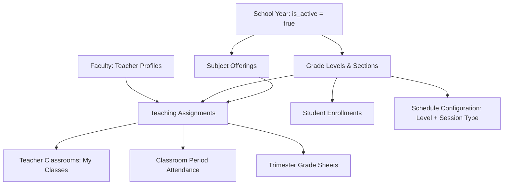
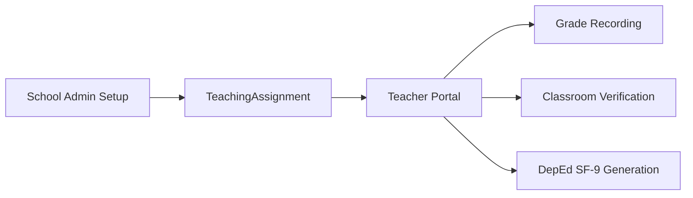

# Academic Setup & Assignment Pipeline

This document explains the hierarchical dependency chain of the school's academic infrastructure, from school year activation down to teacher class assignments and schedule configuration.

---

## 1. Academic Dependency Graph

---

## 2. How to Interpret This Pipeline

Academic setup functions as the structural skeleton for all operational and academic features in the system:

1. **Active School Year Anchor:**
   `App\Models\SchoolYear` acts as the temporal scope. System queries for active enrollments and assignments filter against the active school year (`is_active = true`).
2. **Sections and Session Types:**
   Sections are categorized by:
   * **Level:** Junior High School (JHS) or Senior High School (SHS).
   * **Grade Level:** 7 through 12.
   * **Session Type:** `Morning` or `Afternoon`.
3. **Teaching Assignment Binding:**
   The `TeachingAssignment` model is the central junction table connecting:
   * `Teacher` (Who teaches)
   * `Subject` (What is taught)
   * `Section` (Which cohort attends)
   * `SchoolYear` (Which academic term applies)
4. **Schedule Configuration:**
   `ScheduleConfig` defines scan windows (`in_start`, `in_end`, `late_threshold`, `out_start`, `out_end`) mapped to each specific combination of `level` and `session_type`.

---

## 3. Cross-Module Impact & Workflow Ripple

### Change Impact Analysis

> [!CAUTION]
> **Deactivating or Modifying a Teaching Assignment:**
> * If an admin deactivates a `TeachingAssignment`, the assigned teacher immediately loses access to the grade sheet and attendance roster for that class.
> * Existing student grades and attendance history remain linked in the database, but are excluded from active teacher portal views.
>
> **Modifying Section Session Types:**
> Changing a section's session type from `Morning` to `Afternoon` alters the `ScheduleConfig` resolved during QR station scans, immediately altering whether a student scanning at 12:30 PM is marked as early, on-time, or late.
