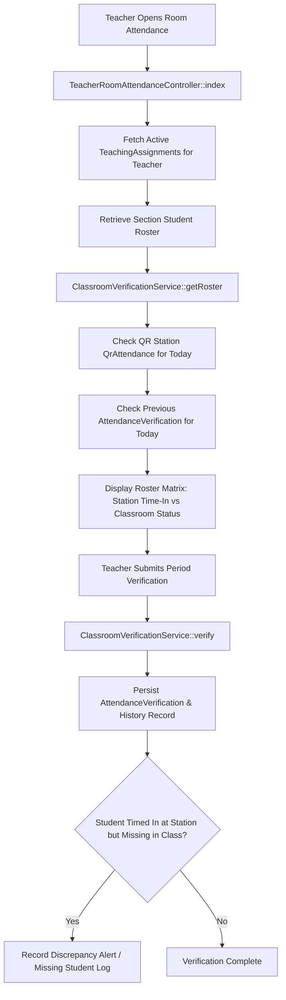
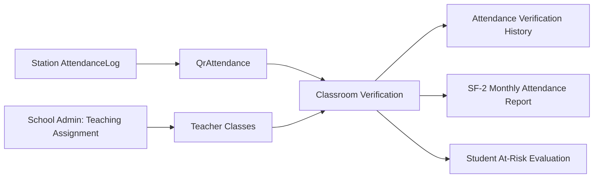

# Classroom Period Attendance Verification

This document covers the subject-level classroom verification workflow where teachers confirm student presence during assigned periods.

---

## 1. Classroom Verification Data Flow

---

## 2. How to Interpret This Workflow

Classroom verification bridges the gap between campus station check-in and actual classroom period attendance:

1. **Teaching Assignment Loading:**
   When an authenticated teacher accesses `/room-attendance`, the controller fetches all sections linked to the teacher via active `teaching_assignments`.
2. **Dual-Status Roster Query:**
   For each student enrolled in the section, `ClassroomVerificationService::getRoster` performs a dual query:
   * **`time_in`:** Did the student self-scan IN at the QR station today (`QrAttendance.time_in_log_id !== null`)?
   * **`classroom_status`:** What is the teacher's current subject-level verification (`present`, `late`, `absent`, `excused`)?
3. **Discrepancy Identification:**
   If a student's station log indicates they scanned `IN` at 7:15 AM, but the teacher marks them `absent` during their 9:00 AM Math period, the system detects a cutting/missing student scenario.
4. **Audit History Tracking:**
   Every status update generates a corresponding row in `attendance_verification_histories` capturing which teacher verified the student and at what timestamp.

---

## 3. Cross-Module Dependencies

### Change Impact Analysis

> [!NOTE]
> **Teaching Assignment Prerequisite:**
> A teacher cannot verify room attendance if the School Admin has not assigned them to the corresponding section and subject in `teaching_assignments`.
>
> **At-Risk & Grading Correlation:**
> Repeated classroom unexcused absences directly feed into `RiskScoreService`. When unexcused classroom absences cross risk thresholds, the student is automatically surfaced in the teacher's **At-Risk** dashboard.
