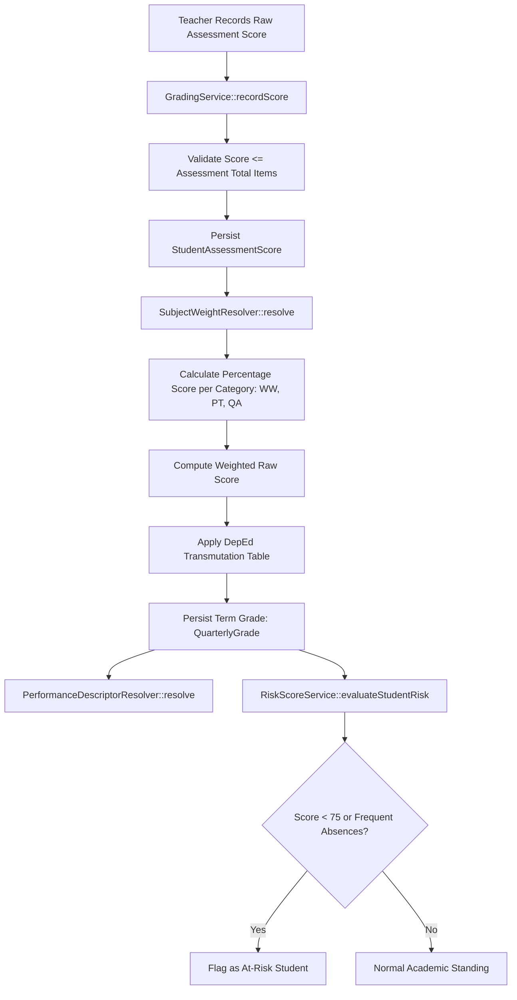
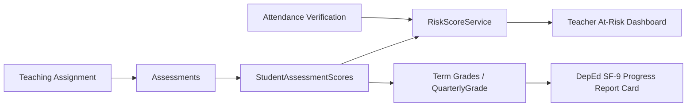

# Grading System & Assessment Calculation Engine

This document outlines the DepEd-compliant trimester assessment architecture, grade transmutation algorithms, subject weighting matrices, and at-risk student scoring.

---

## 1. Grade Calculation Pipeline

---

## 2. How to Interpret This Pipeline

The grading engine enforces strict adherence to Philippine Department of Education (DepEd) Order No. 8, s. 2015 & s. 2016:

1. **Assessment Categories:**
   Assessments are classified into three standard components:
   * **Written Works (WW):** Quizzes, unit tests, written outputs.
   * **Performance Tasks (PT):** Projects, demonstrations, laboratory experiments, group collaborations.
   * **Quarterly/Term Assessment (QA):** Cumulative term examinations.
2. **Subject Weight Resolution (`SubjectWeightResolver`):**
   Weights vary dynamically depending on department level and subject classification:
   * **Junior High School (JHS / HS):** WW (20%), PT (50%), QA (30%) across general academic subjects.
   * **Senior High School (SHS):** Tailored weights based on `subjects.subject_type` (e.g. Core vs. TVL/Track specializations).
3. **DepEd Transmutation Formula:**
   Raw weighted scores ($[0, 100]$) are mapped to standard DepEd transmuted grades where a raw score of $60\%$ represents the passing threshold of $75$.
4. **Performance Descriptors (`PerformanceDescriptorResolver`):**
   * **$90 - 100$:** Advancing (Passed)
   * **$88 - 89$:** Benchmarking (Passed)
   * **$80 - 87$:** Progressing (Passed)
   * **$75 - 79$:** Connecting (Passed)
   * **Below $75$:** Developing (Failed)
5. **Early Warning Risk Engine (`RiskScoreService`):**
   Continuously cross-references failing assessment trends with QR station and room attendance rates. When composite risk criteria are met, students appear in the teacher's **At-Risk** portal tab with actionable academic remarks.

---

## 3. Module Relationships & Cross-System Impact

### Change Impact Analysis

> [!WARNING]
> **Modifying Assessment Total Items:**
> Updating `total_items` on an existing assessment recalculates the percentage score for every enrolled student who already received a score.
>
> **DepEd Report Card Finalization (SF-9):**
> Official DepEd Form 9 report cards compile transmuted trimester grades directly from `QuarterlyGrade`. Incomplete score entry in any single component category prevents final term descriptor calculation.
