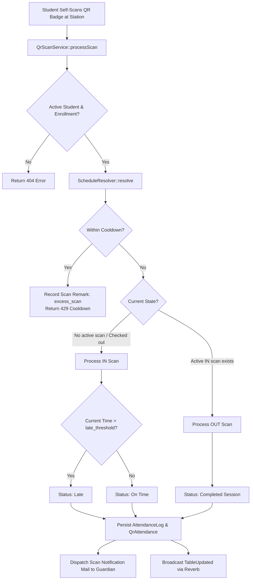
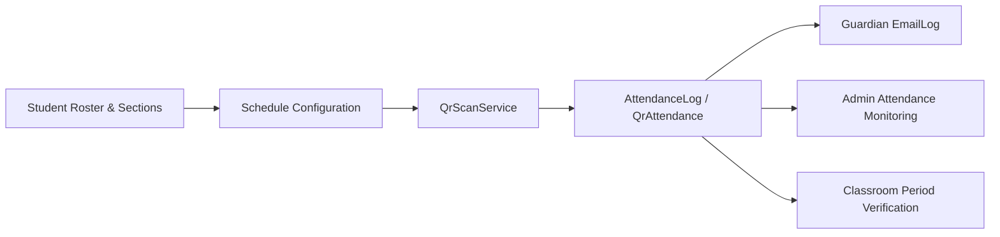

# QR Station Attendance & Self-Service Kiosk Workflow

This document details the operational workflow, state machine mechanics, and data dependencies of the **Self-Service QR Scanning Station**.

---

## 1. High-Level Data Flow & State Machine

---

## 2. How to Interpret This Workflow

The QR scanning station functions as an autonomous, **self-service kiosk**:

1. **Self-Service Student Scanning:**
   Students physically present their QR code badge to the camera reader or optical scanner at the station terminal. No manual operator scan is required; the kiosk continuously monitors the optical feed and submits automatically.
2. **Scanner Operator Role Clarification:**
   The `scanner_operator` account is **not a guard or security personnel**. It is simply a dedicated user profile intended to log in and keep the kiosk terminal running (`/qr-station`) and provide a clean dashboard for observing daily time-in and time-out activity (`/time-in-time-out-history`).
3. **Student & Enrollment Resolution:**
   The scanned token is matched against `students.student_number` or `qr_codes.token`. The system checks `enrollments` joined with `sections` to ensure the student is currently active, retrieving their grade level and session type (`Morning` or `Afternoon`).
4. **Schedule Evaluation:**
   `App\Services\ScheduleResolver` looks up the active `schedule_configs` record matching the section level and current time. If scanning occurs outside scheduled operating hours, a schedule discrepancy remark is logged.
5. **Cooldown & Scan Remarks:**
   To prevent multiple rapid scans from a student repeatedly holding their card in view, a configurable cooldown timer is enforced. Attempts made during the cooldown window are intercepted, generating a **scan remark** (`remark_type: 'excess_scan'`) and returning an HTTP `429` response.
6. **State Machine Transitions:**
   * **`IN` (Time In):** Assigned when no prior record exists for the day or the student previously checked out. If the timestamp exceeds `schedule.late_threshold`, status is marked `late`; otherwise, `on_time`.
   * **`OUT` (Time Out):** Assigned when an active `IN` record exists and current time is within dismissal hours (`out_start` to `out_end`).
7. **Guardian Notification & Real-Time Broadcast:**
   Once persisted, a notification email is queued for the student's guardian (`guardians.email`), and a `TableUpdated` event is broadcast across WebSocket channels via **Laravel Reverb** to immediately update live dashboards.

---

## 3. Module Relationships & Dependencies

### Change Impact Analysis

> [!WARNING]
> **Cascading Schedule Changes:**
> The `ScheduleResolver` relies on `sections.session_type` and `schedule_configs` time boundaries. Modifying schedule time ranges or changing a section's session type will immediately shift the `late_threshold` calculation and can cause legitimate student self-scans to be marked as `late` or `outside_schedule`.
>
> **Classroom Verification Downstream:**
> The `AttendanceLog` produced at the station serves as the baseline for the Teacher's Classroom Period Verification. If a student does not perform a Time-In at the QR station, teachers will see them flagged as missing or unverified at the room level.
