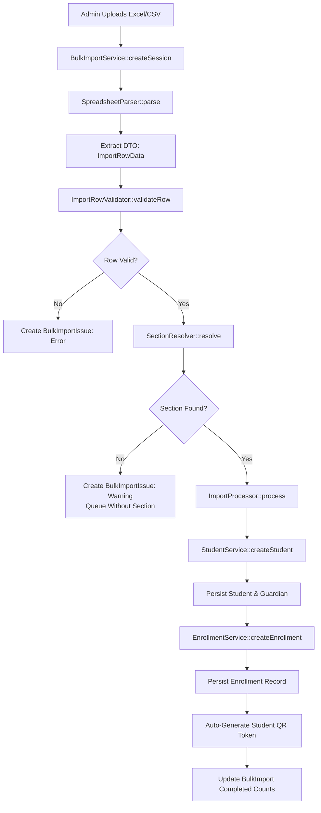
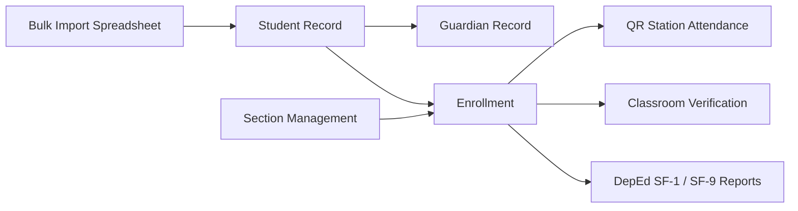

# Student Management & Bulk Import Pipeline

This document outlines the student lifecycle, from initial roster ingestion via Excel/CSV spreadsheet import through individual record updates and section enrollment.

---

## 1. Bulk Import Data Flow

---

## 2. How to Interpret This Pipeline

The bulk import system is engineered for high fault tolerance during institutional enrollment surges:

1. **Session Orchestration (`BulkImportService`):**
   When an administrative user uploads an enrollment sheet at `/bulk-import`, a parent `BulkImport` session is created in the database to track overall progress, total rows, successful inserts, and failure counts.
2. **Spreadsheet Parsing & DTO Extraction (`SpreadsheetParser`):**
   Utilizes `PhpOffice\PhpSpreadsheet` to inspect header aliases (e.g. "LRN", "Learner Reference Number", "First Name", "Guardian Contact"). Each physical row is transformed into an immutable `App\DTOs\ImportRowData` instance.
3. **Pre-Insert Validation (`ImportRowValidator`):**
   Validates standard DepEd constraints:
   * 12-digit Learner Reference Number (LRN) validation and duplicate checks.
   * Required name components (First Name, Last Name, Middle Name, Suffix).
   * Valid email format for guardian notifications.
4. **In-Memory Section Resolution (`SectionResolver`):**
   Pre-loads existing sections into an in-memory hash map (`"name|level|grade_level"`) to eliminate N+1 database queries across large cohorts. If a section cannot be matched, the student is created as unassigned, and a non-fatal `BulkImportIssue` warning is logged.
5. **Atomic Persistence & QR Initialization:**
   `StudentService` commits the `students` and `guardians` records inside a database transaction. Next, `EnrollmentService` establishes the `enrollments` pivot. Finally, a unique alphanumeric QR token is generated so the student's badge is immediately ready for station scanning.

---

## 3. Module Relationships & Change Impact

### Change Impact Analysis

> [!IMPORTANT]
> **Downstream Impact on Kiosk Scanning:**
> A student record created without an active `enrollments` row cannot self-scan at the QR station kiosk. The `QrScanService` will return a `404 No active enrollment` error.
>
> **Section Deletion Safeguards:**
> Deleting or renaming a section directly breaks `SectionResolver` lookups on re-import and disconnects enrolled students from teacher room rosters. Sections should be archived (`status = inactive`) rather than hard deleted.
