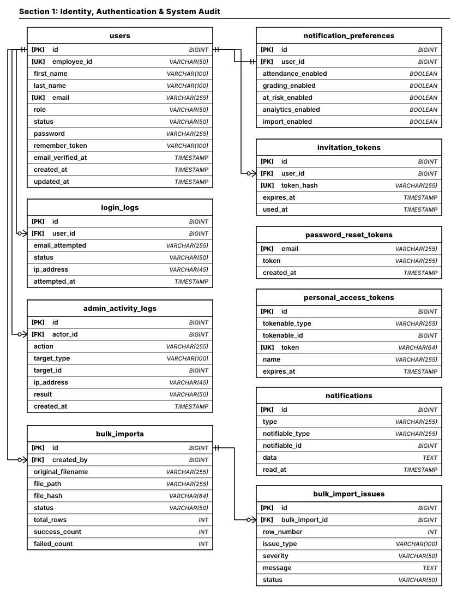
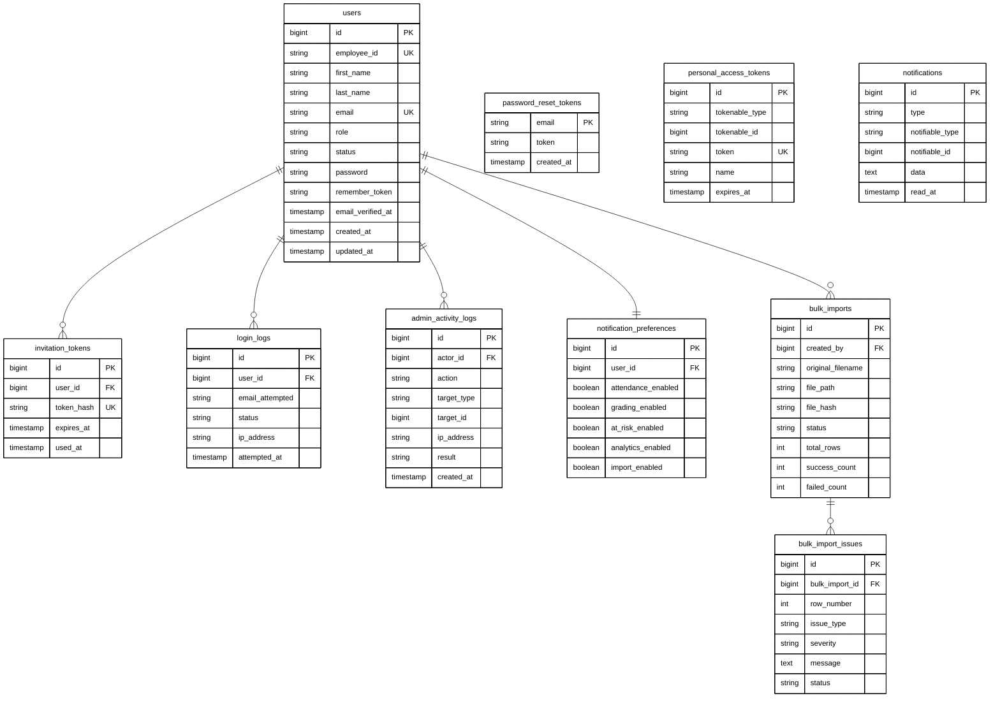

# Section 1: Identity, Authentication & System Audit ERD

Modular Entity Relationship Diagram documenting user identity, authentication credentials, security session logs, administrative audit trails, and bulk import tracking.

## Architectural Constraints & Specifications
- **Palette**: Pure monochrome (`#000000` text/stroke on `#FFFFFF` canvas). Zero colored fills or badges.
- **Connectors**: Strictly orthogonal Crow's Foot ERD notations (`||--o{`, `||--||`).
- **Precision Anchors**: Foreign Keys anchor directly from parent Primary Key (`users.id` / `bulk_imports.id`).
- **Clean Routing**: Pure blank connector paths with no text labels.

---

## High-Precision Vector Diagram

---

## Mermaid UML Definition

---

## Entity Catalog & Relationships

| Source Entity (Parent) | Relationship | Target Entity (Child) | Foreign Key | Description |
| :--- | :---: | :--- | :--- | :--- |
| `users.id` | `1 : N` | `invitation_tokens` | `user_id` | Account setup and activation tokens sent to staff. |
| `users.id` | `1 : N` | `login_logs` | `user_id` | Audit trail of successful and failed authentication attempts. |
| `users.id` | `1 : N` | `admin_activity_logs` | `actor_id` | Detailed security action logs performed by administrative users. |
| `users.id` | `1 : 1` | `notification_preferences` | `user_id` | Granular subscription toggle switches per staff account. |
| `users.id` | `1 : N` | `bulk_imports` | `created_by` | History of uploaded CSV/Excel roster import batches. |
| `bulk_imports.id` | `1 : N` | `bulk_import_issues` | `bulk_import_id` | Line-by-line validation errors or warnings from an import file. |
