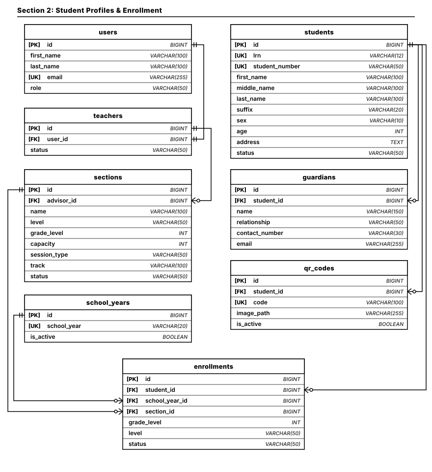
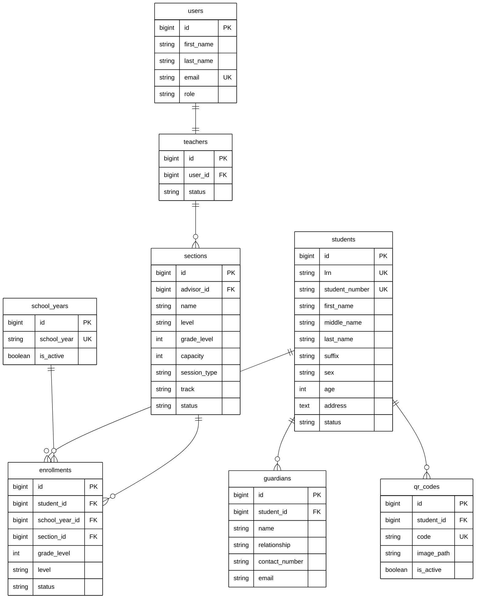

# Section 2: Student Profiles & Enrollment ERD

Modular Entity Relationship Diagram documenting student master profiles, demographic data, guardian emergency contacts, unique QR authentication tokens, academic school years, class sections, and student enrollment records.

## Architectural Constraints & Specifications
- **Palette**: Pure monochrome (`#000000` text/stroke on `#FFFFFF` canvas). Zero colored fills or badges.
- **Connectors**: Strictly orthogonal Crow's Foot ERD notations (`||--o{`, `||--||`).
- **Precision Anchors**: Foreign Keys anchor directly from parent Primary Key (`users.id`, `students.id`, `school_years.id`, `sections.id`).
- **Clean Routing**: Pure blank connector paths with no text labels.

---

## High-Precision Vector Diagram

---

## Mermaid UML Definition

---

## Entity Catalog & Relationships

| Source Entity (Parent) | Relationship | Target Entity (Child) | Foreign Key | Description |
| :--- | :---: | :--- | :--- | :--- |
| `users.id` | `1 : 1` | `teachers` | `user_id` | Staff account linking to academic faculty profile. |
| `teachers.id` | `1 : N` | `sections` | `advisor_id` | Section advisory assignment held by faculty. |
| `students.id` | `1 : N` | `guardians` | `student_id` | Parents, guardians, and emergency contact details. |
| `students.id` | `1 : N` | `qr_codes` | `student_id` | Cryptographic QR identification card/token. |
| `students.id` | `1 : N` | `enrollments` | `student_id` | Annual enrollment history across academic levels. |
| `school_years.id` | `1 : N` | `enrollments` | `school_year_id` | Active academic school calendar binding. |
| `sections.id` | `1 : N` | `enrollments` | `section_id` | Classroom section placement for the term. |
