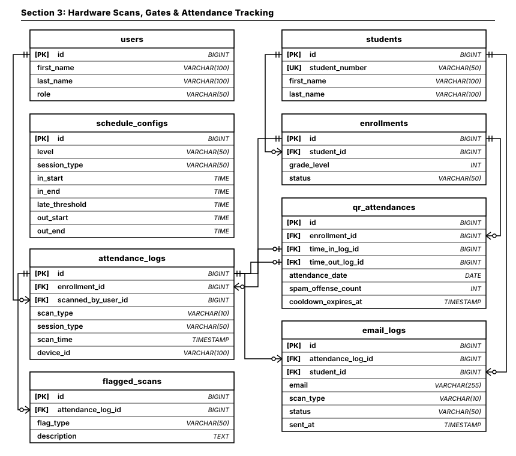
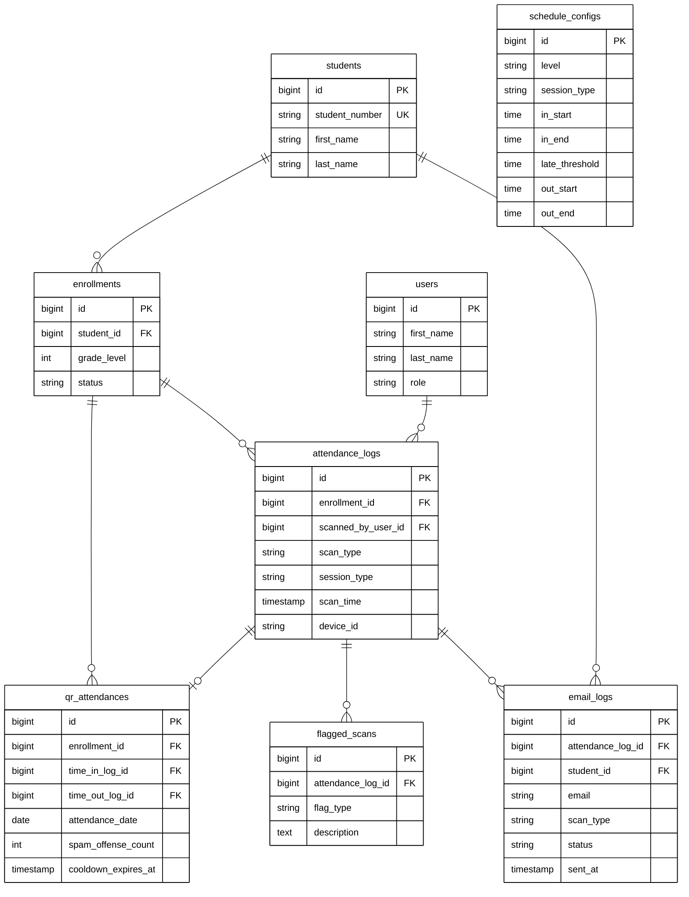

# Section 3: Hardware Scans, Gates & Attendance Tracking ERD

Modular Entity Relationship Diagram documenting high-throughput kiosk/station hardware scans, daily gate attendance tracking, anti-passback duplicate protection, scan flagging, and automated guardian email alerts.

## Architectural Constraints & Specifications
- **Palette**: Pure monochrome (`#000000` text/stroke on `#FFFFFF` canvas). Zero colored fills or badges.
- **Connectors**: Strictly orthogonal Crow's Foot ERD notations (`||--o{`, `||--o|`).
- **Precision Anchors**: Foreign Keys anchor directly from parent Primary Key (`students.id`, `enrollments.id`, `users.id`, `attendance_logs.id`).
- **Clean Routing**: Pure blank connector paths with no text labels.

---

## High-Precision Vector Diagram

---

## Mermaid UML Definition

---

## Entity Catalog & Relationships

| Source Entity (Parent) | Relationship | Target Entity (Child) | Foreign Key | Description |
| :--- | :---: | :--- | :--- | :--- |
| `students.id` | `1 : N` | `enrollments` | `student_id` | Student academic enrollment records. |
| `enrollments.id` | `1 : N` | `attendance_logs` | `enrollment_id` | Immutable physical scans recorded at hardware gates. |
| `users.id` | `1 : N` | `attendance_logs` | `scanned_by_user_id` | Scanner operator or automated kiosk system identity. |
| `enrollments.id` | `1 : N` | `qr_attendances` | `enrollment_id` | Daily consolidated attendance rollups with cooldown state. |
| `attendance_logs.id` | `1 : 0..1` | `qr_attendances` | `time_in_log_id` | Link to specific morning gate arrival log. |
| `attendance_logs.id` | `1 : 0..1` | `qr_attendances` | `time_out_log_id` | Link to specific dismissal gate exit log. |
| `attendance_logs.id` | `1 : N` | `flagged_scans` | `attendance_log_id` | Anomaly records (late arrival, duplicate scan, cooldown spam). |
| `attendance_logs.id` | `1 : N` | `email_logs` | `attendance_log_id` | Guardian notification dispatches triggered by gate scan. |
| `students.id` | `1 : N` | `email_logs` | `student_id` | History of notification emails sent regarding this student. |
