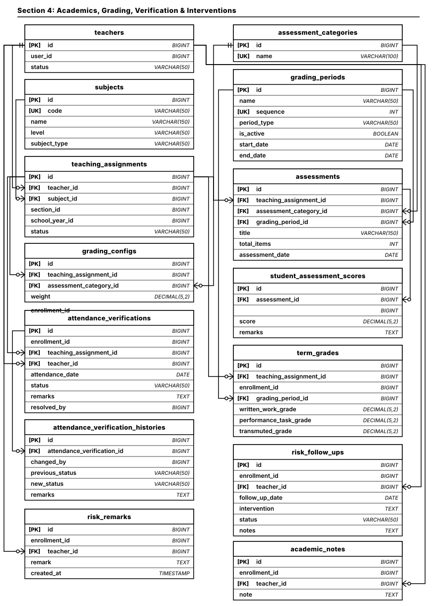
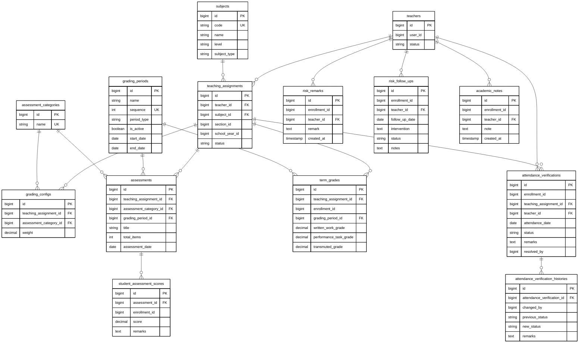

# Section 4: Academics, Grading, Verification & Interventions ERD

Modular Entity Relationship Diagram documenting teacher instructional loads, DepEd academic grading configurations, student quarterly assessment scores, classroom attendance verifications, and academic intervention notes.

## Architectural Constraints & Specifications
- **Palette**: Pure monochrome (`#000000` text/stroke on `#FFFFFF` canvas). Zero colored fills or badges.
- **Connectors**: Strictly orthogonal Crow's Foot ERD notations (`||--o{`).
- **Precision Anchors**: Foreign Keys anchor directly from parent Primary Key (`teachers.id`, `subjects.id`, `teaching_assignments.id`, `grading_periods.id`, `assessment_categories.id`, `assessments.id`, `attendance_verifications.id`).
- **Clean Routing**: Pure blank connector paths with no text labels.

---

## High-Precision Vector Diagram

---

## Mermaid UML Definition

---

## Entity Catalog & Relationships

| Source Entity (Parent) | Relationship | Target Entity (Child) | Foreign Key | Description |
| :--- | :---: | :--- | :--- | :--- |
| `teachers.id` | `1 : N` | `teaching_assignments` | `teacher_id` | Instructional schedule linking teacher, subject, section, and term. |
| `subjects.id` | `1 : N` | `teaching_assignments` | `subject_id` | Curriculum course associated with a teaching assignment. |
| `teaching_assignments.id` | `1 : N` | `grading_configs` | `teaching_assignment_id` | Category weight distribution (e.g. 40% Written Work, 60% Perf Tasks). |
| `assessment_categories.id` | `1 : N` | `grading_configs` | `assessment_category_id` | DepEd component type link (WW, PT, QA). |
| `teaching_assignments.id` | `1 : N` | `assessments` | `teaching_assignment_id` | Quizzes, exams, and projects created by the instructor. |
| `grading_periods.id` | `1 : N` | `assessments` | `grading_period_id` | Quarter/Term association for assessment items. |
| `assessment_categories.id` | `1 : N` | `assessments` | `assessment_category_id` | Component categorization of the assessment. |
| `assessments.id` | `1 : N` | `student_assessment_scores` | `assessment_id` | Individual raw student scores recorded in E-Class record. |
| `teaching_assignments.id` | `1 : N` | `term_grades` | `teaching_assignment_id` | Quarterly composite grade records. |
| `grading_periods.id` | `1 : N` | `term_grades` | `grading_period_id` | Grading quarter target for term report cards. |
| `teaching_assignments.id` | `1 : N` | `attendance_verifications` | `teaching_assignment_id` | Subject-room physical attendance audit checks. |
| `teachers.id` | `1 : N` | `attendance_verifications` | `teacher_id` | Verification logging by the presiding instructor. |
| `attendance_verifications.id` | `1 : N` | `attendance_verification_histories` | `attendance_verification_id` | Immutable audit changes for attendance resolutions. |
| `teachers.id` | `1 : N` | `risk_remarks` | `teacher_id` | Early warning academic/attendance risk observations. |
| `teachers.id` | `1 : N` | `risk_follow_ups` | `teacher_id` | Scheduled remediation, counseling, and parent conferences. |
| `teachers.id` | `1 : N` | `academic_notes` | `teacher_id` | General qualitative teacher commentary on student behavior. |
